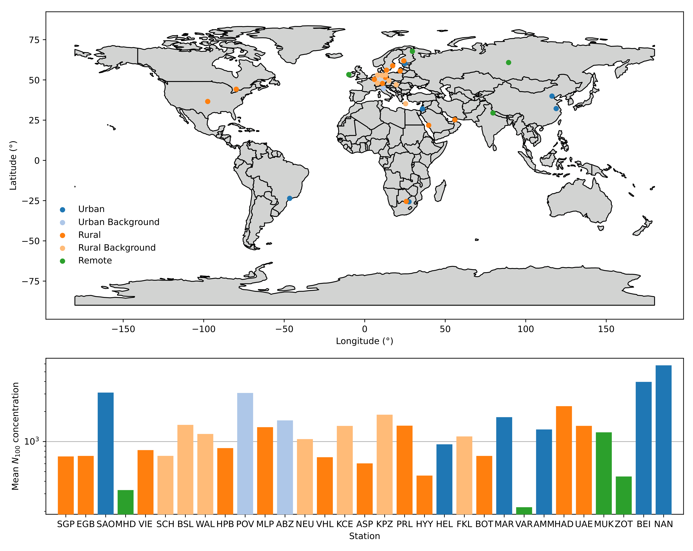
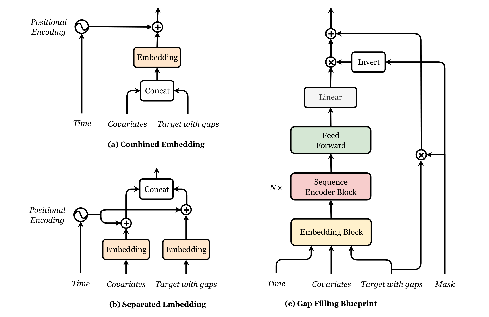

# GapT: Gap-filling Transformer for Multivariate Timeseries

GapT is a gap-filling framework leveraging past, present, and future information alongside relevant covariates to fill in gaps in time series.

## Introduction

Time series data is fundamental to environmental research. However, gaps often occur due to equipment malfunctions, data transmission errors, or adverse environmental conditions. Accurate gap filling is crucial for enhancing the quality of time series data, enabling better modeling, forecasting, and analysis. Traditional approaches include linear interpolation, ARIMA, and $k$-nearest neighbors, MLPs etc. However, it is desirable to better capture temporal dependencies. Recurrent deep learning models, including LSTM, and GRU architectures, have therefore been employed successfully for gap filling. Transformers, with their self-attention mechanism, also provide a powerful alternative.

GapT builds on the seq2seq paradigm, introducing architectural improvements that enhance performance in time series gap filling. You can choose from several encoders including dilated 1D convolution, bidirectional LSTM, GRU and LRU, as well as the Transformer. This code is an open source and improved upon version of [Richard et al. Filling Gaps in Micro-meteorological Data, ECML PKDD 2020](https://doi.org/10.1007/978-3-030-67670-4_7), in PyTorch Lightning.

## Atmospheric Dataset

GapT is evaluated here using aerosol concentration data ($N_{100}$) from 31 stations across five continents. The dataset is augmented with covariates from the Copernicus Atmospheric Monitoring System (CAMS), including aerosol, gas, and meteorological variables relevant to cloud condensation nuclei. The dataset showcased here was processed in [notebooks/preprocess_data.ipynb](notebooks/preprocess_data.ipynb) and the dataloader was created in [notebooks/create_dataloader.ipynb](notebooks/create_dataloader.ipynb). The following figure shows the station locations and average $N_{100}$ concentrations:



---

## Gap Filling Framework

Given a time series of measurements, the objective is to predict missing values within a target sequence using covariates and the incomplete sequence of targets. This is formulated as:

Let $x_i(t)$ be the set of observed variables such that $\forall i \in [1, n], \forall t \in [1, T], x_i(t) \in \mathbb{R}$ and let $z_i(t)$ be the set of non-observed variables such that $\forall i \in [1, m], \forall t \in [1, T], z_i(t) \in \mathbb{R}$. Filling in missing target values can then be written as the mapping:
$$
\begin{aligned}
    y(t&) = f(x_1 (t), \ldots, x_n(t), z_1(t), \ldots, z_m(t)) \in \mathbb{R}, \\
    &\forall i \in [1, n], \exists \tau_i \in \mathbb{R}\ \mathrm{s.t.}\ x_i(t) = x_i(t+\tau_i) + \epsilon.
\end{aligned}
$$
In this formulation, $x$ denotes the sequence of covariates, and $y$ the sequence of targets. This framework leverages information from the past, present and future to fill in missing data. Below is a visualization of the task for our atmospheric data, with covariates in a reduced opacity and the target gap in blue:


## Modular Architecture

GapT is designed modularly for flexibility and extensibility. The encoder block can currently be chosen as `transformer`, `lru`, `lstm`, `gru`, `tcn`, `mlp`. The encoder modules are illustrated below:


We also explore two embedding strategies:
1. **Combined Embedding:** Concatenates covariates and targets before embedding.
2. **Separated Embedding:** Embeds covariates and targets separately, then concatenates them.

The embedding variations and the full modular architecture are shown below:



## Results

Plots created in [notebooks/produce_results.ipynb](notebooks/produce_results.ipynb)


## Run training

Requires Pytorch Lightning installed.

Individual run:

```sh
python train.py \
  --devices 1 \
  --num_workers 32 \
  --batch_size 256 \
  --epochs 60 \
  --n_head 8 \
  --n_layers 6 \
  --d_model 128 \
  --d_feedforward 256 \
  --learning_rate 0.01 \
  --dropout_rate 0.2 \
  --optimizer momo \
  --model gapt \
  --data_dir data/two_week_seq \
  --output_dir results/gapt
```

Full experiment:

```sh
bash submit.sh
```

## Cite

Baseline

```BibTex
@inproceedings{richard2021,
  title={Filling gaps in micro-meteorological data},
  author={Richard, Antoine and Fine, Lior and Rozenstein, Offer and Tanny, Josef and Geist, Matthieu and Pradalier, Cedric},
  booktitle={Machine Learning and Knowledge Discovery in Databases. Applied Data Science and Demo Track: European Conference, ECML PKDD 2020, Ghent, Belgium, September 14--18, 2020, Proceedings, Part V},
  pages={101--117},
  year={2021},
}
```

GapT

```BibTex
@misc{gapt2025,
  title={GapT: Gap-filling Transformer for Multivariate Timeseries},
  author={Holmberg, Daniel},
  year={2025},
  howpublished={\url{https://github.com/deinal/gapt}},
}
```